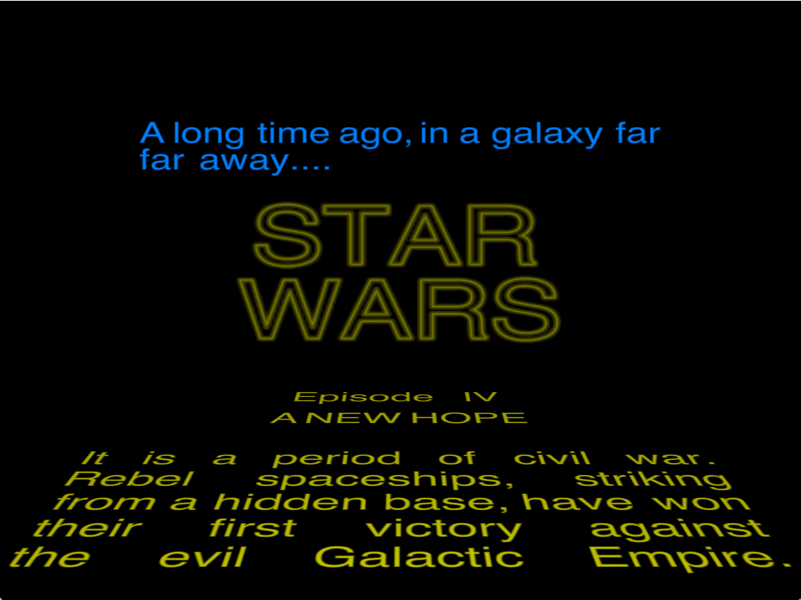
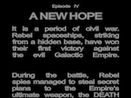
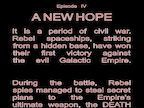
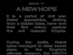
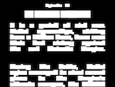
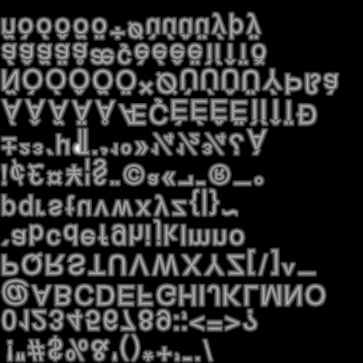
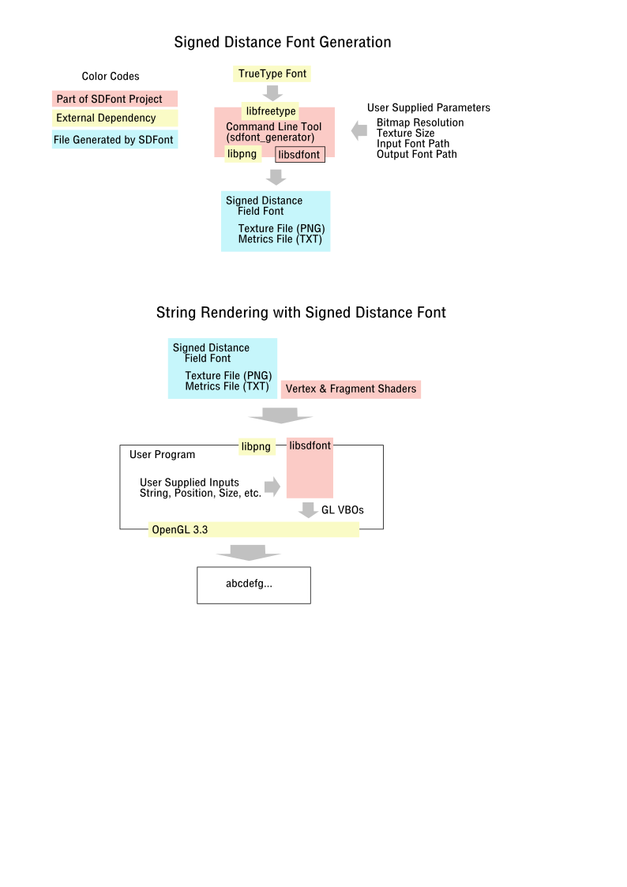

# SDFont : Signed Distance Font Generator and Runtime Utility


Demo Video (Click to play)
<a href="https://youtu.be/p1f0NFHqdbI">
    
</a>


# Overview


Signed Distance Field Font is a technology proposed by 
<a href="https://steamcdn-a.akamaihd.net/apps/valve/2007/SIGGRAPH2007_AlphaTestedMagnification.pdf">
Chris Green of Valve at SIGGRAPH 2007
</a>
It is based on the anti-aliasing processing in the GPUs.
Each glyph is drawn as a textured quadrilateral.
Thanks to the very clever use of alpha channel in conjunction with the 
anti-aliasing sampling in the GPUs,
the resultant shape of the fonts is clean with little artifacts
for most of the sizes.


Following are some samples rendered with a signed distance field font.
(Click to enlarge.)

<a href="docs/readme/Type0.png">
    
</a>
<a href="docs/readme/Type1.png">
    
</a>
<a href="docs/readme/Type2.png">
    
</a>
<a href="docs/readme/Type3.png">
    
</a>
<a href="docs/readme/Type4.png">
    
</a>
<a href="docs/readme/Type5.png">
    
</a>
<a href="docs/readme/Type6.png">
    
</a>


From left to right:
- Type 0: Raw output  by a pass-thru fragment shader.
- Type 1: Softened edge by smooth-step function.
- Type 2: Hard-edge by threshold on alpha.
- Type 3: Glare/Helo effect
- Type 4: Outline by hard thresholds
- Type 5: Hollow fonts with soft edges
- Type 6: Correspondint quadrilaterals to which the texture is mapped.


# Benefits


- Continuously scalable font size, maintaing the clean edges without major
artefacts.
- Handle unlimited number of sizes at the same time without memory and
processing overhead.
- Ability to dynamically change the size and shape of each glyph at runtime
without memory and processing overhead.

These benefits come form the fact that each glyph, which is usually in 
a Flyweight object in a program, is represented by a textured quadrilateral
region in a set of coordinates into the output screen space, and another set 
of coordinates into the texture map.

# How To Build

## Requirements
- conan2 package manager
- CMake (v3.10+)
- C++14 compiler

## Build instructions

Create and switch to build directory:
```
mkdir build
cd build
```

Compile dependencies with conan package manager:
```
conan install .. --output-folder=. --build=missing
```

Initialize CMake:
```
cmake -DCMAKE_BUILD_TYPE=Release ..
```

Build all targets (library and executables):
```
make -j$(nproc)
```

# How It Works

## Font Generation


1. For each glyph, generate glyph bitmap in big enough size, (e.g. 4096 * 4096)

2. Generate signed distance for each point in the bitmap.

Signed distance is the distance to the closest point of the opposite bit.

For example, if the current point is set and it finds the closest unset point
 at 4 points away, then the signed distance is 4.

On the other hand, if the current point is unset and it finds the closest set
point at 2 points away, then the signed distance is -2.

3. Down-sample the points in the signed distance field (e.g. 10x10 for low res
and 40x40 for high res).

4. Clamp the signed distance value of each sampled pixel into a limited range
[-spread, spread], and normalize it into [0, 255].
This means the pixel on the boundary of the glypy gets the value of 128, and
an unset point far from the glyph gets 0.

5. Pack the downsampled glyphs into a single texture map with the normalied
signed distance into the alpha channel.
Following figure illustrates a generated texture.
Please note that the glyphs are drawn upside down in the figure due to the
difference in the vertical coordinate axes between PNG (downward) and
OpenGL Texture (upward).

<a href="docs/readme/sample_texture.png">

</a>

6. Generate the metrics of each glyph. It inclues the position of the glyph
in the UV texture coordinates as well as the font metrics such as bearing and
kernings.


## Font Rendering at Runtime

The glyph is drawn as a transformed textured quadrilateral on the screen.
The user gives the coordinates of the quadrilateral together with their
attributes such as the corresponding texture coordinates, normals and colors.
The rest is handled by a graphic subcomponent such as OpenGL.
The geometric transformation (either 3D or Otrhogonal 2D) and 
rasterization are done by the hardward utilizing GPU.
The rasterization is considered up-sampling from the texture.
Each pixel in the screen obtains a signed-distance value in the alpha channel
pretty accurately, thanks to the interpolation mechanism in the rasterizer.

The fragment shader then use the recovered signed distance value to draw the 
pixel there on the screen.
For example, for Type 2 agove, a pixel is set if the recorvered signed distance
in the normalized alpha is above the threshold 0.5 (128). This gives an clear
edge for the glyphs.
User can supply their own shaders for other effects shown above from Type 0 to
6.


# SDFont Implementation
Here's an overview of SDFont, which consists of three parts: 
    sdfont_generator, libsdfont, and the shader pair.

<a href="docs/readme/overview.png">

</a>

## sdfont_generator
This is a command line tool to generate a pair of files (PNG & TXT)
from the user-specified TrueType font. The pair of files are loaded
to the user program at runtime.
Following is the list of command line parameters.

- -locale : Locale. The default value is 'en_US.ISO8859-1'.

- -font_path : Path to a TrueType font. The default value is
                 '/Library/Fonts/Arial.ttf'.

- -max_code_point : The highest code point in the specified font.
Used to pack the glyphs to one texture. The default is 255.

- -texture_size : The width and height of the square texture.
This must be a power of 2. The default is 4096.

- output file name w/o extention : The default is 'signed_dist_font'.

The output PNG file looks like the one shown in Font Generation above.
It wll be loaded as a texture map at runtime.
The output TXT file consists of three parts: Margin, Glyphs, and Kernings.
The Margin has one value that represents the rectangular extent around each 
glyph in which the signed distance fades out.
In Glyphs section, each line represents a glyph metrics.
The line consists of the following fields.

- Code Point
- Width
- Height
- Horizontal Bearing X
- Horizontal Bearing Y
- Horizontal Advance
- Vertical Bearing X
- Vertical Bearing Y
- Vertical Advance

The fields above are taken from the input TrueType font but scaled to the
normalized texture coordinates.

- Texture Coord X : Left side of the glyph bit map in the texture coordinates.
- Texture Coord Y : Bottom side of the glyph bit map in the texture coordinates.
- Texture Width : Width of the bitmap in the texture coordinates.
Same as 'Width' above.
- Texture Height : Height of the bitmap in the texture coordinates.
Same as 'Height' above.

## libsdfont
This is the runtime library. The command line sdfont_generator is
built on top that, too.

The user program must include the following header files.
```c++
runtime_helper.hpp
texture_loader.hpp
metrics_parser.hpp
vanilla_shader_manager.hpp
```

and then initialize libsdfont with the following idiom.

```c++
SDFont::RuntimeHelper helper;

SDFont::TextureLoader loader ( "signed_dist_font.png" );

SDFont::MetricsParser parser ( helper.glyphs(), helper.margin() );

parser.parseSpec( "signed_dist_font.txt" );

SDFont::VanillaShaderManager  shader ( loader.GLtexture(), 0 );
```

To render glyphs for a given string, use the following.
```c++
SDFont::RuntimeHelper::getMetrics()

```
This takes a string and generates a list of glyph metrics.

```c++
SDFont::RuntimeHelper::generateOpenGLDrawElements()
```
This generates Open GL VBOs for the given list of glyphs at specific location.


```c++
SDFont::VanillaShaderManage::draw()
```
This draws the VBOs using the shader pair. It also handles the uniform
variables defined in the shaders. The shaders are found in [shaders](shaders).

```c++
SDFont::mShader.draw()
```

## Shaders
SDFont provides a pair of vertex & fragment shader programs.
The vertex shader 
[shaders/VanillaSignedDistFontVertex.glsl](shaders/VanillaSignedDistFontVertex.glsl)
is an orthodox 3D perspetcive projectio shader.

The defined uniforms are:
- P (mat4) : Projection matrix.
- M (mat4) : Model matrix.
- V (mat4) : View magrix.
- lightWCS (vec3) : Light source in the world coordinate system.

The VBOs for this vertex shader, which is the output from 
SDFont::RuntimeHelper::generateOpenGLDrawElements() and input to 
SDFont::mShader.draw() has the following format.

- vertexLCS(vec3) : Point in the model coordinate system.
- normalLCS(vec3) : Normal in the model coordinate system. Not used at moment.
- texCoordIn(vec2): UV texture coordinates.

The fragment shader 
[shaders/VanillaSignedDistFontFragment.glsl](shaders/VanillaSignedDistFontFragment.glsl)
is the main part and it takes care of the glyph rendering.
It has the following uniforms.

- fontTexture (sampler2D) : The ID (name) of the texture created from the PNG.
- effect (int) : type of face to be rendered. See tye types above.
- useLight (bool) : set to true if light source specified by lightWCS is used.
- lowThreshold (float) : The threshold for the alpha channel.
Used by type 2,3, and 4. It is used to find the boundary beteen glyph and
non-glyph pixels.
- highThreshold (float) : Another threshold for the alpha channel.
Used by type 4. It is used to find the boundary for the inner curve for the
follow face.

- smoothing (float) : Smomothing parameter for the smooth step function.
- baseColor (vec3) :  Main color for the glyph.
- borderColor (vec3) : Secondary color for the glyph.

# Sample
A sample code for the Star Wars opening is found in 
[src_bin/demo.cpp](src_bin/demo.cpp).


# Limitations

- Can’t beat the Shannon’s sampling theorem.
When a small texture (e.g. 128x128) is used, 
magnified glyphs will show some noticeable artifacts on the screen.

- The number of different fonts shown simultaneously at realtime is limited
to the number of active loaded Textures (usually 16 for OpenGL).
One way to get around this is to pack multiple fonts into a single texture.
For example a texture of size 4K x 4K can accommodate 64 512x512 SD fonts, 
or 256 256x256 SD fonts. SDFont currently supports only one font per texture.
Multiple fonts per texture may be supported in the future.
This technique is not suitable for some East Asian writing systems, which have
thousands of glyphs.

- Wasted space in the texture. Only one out of 4 bytes is effectively used.
Apparently OpenGL does not allow alpha-only texture, and there is no way
to utilized RGB bytes.


# TODO

- Support on iOS

- Packing multiple fonts into a single texture.


# License


Copyright (c) 2019 Shoichiro Yamanishi

Wailea is released under MIT license. See `LICENSE` for details.


# Contact


For any inquiries, please contact:
Shoichiro Yamanishi

yamanishi72@gmail.com


# Reference


* [Green07]
Chris Green. 2007. Improved alpha-tested magnification for vector textures and special effects. In ACM SIGGRAPH 2007 courses (SIGGRAPH '07). ACM, New York, NY, USA, 9-18. DOI: https://doi.org/10.1145/1281500.1281665
