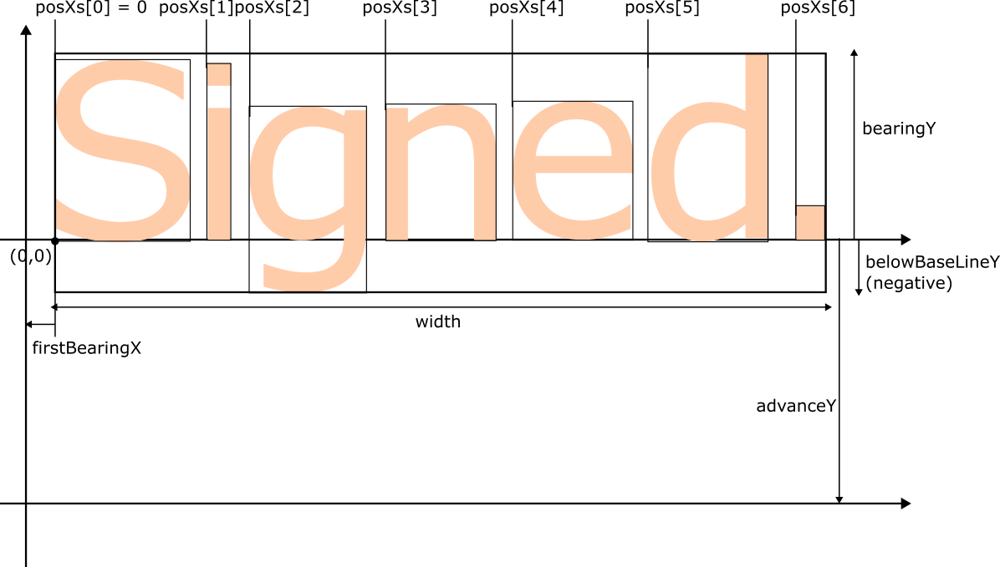
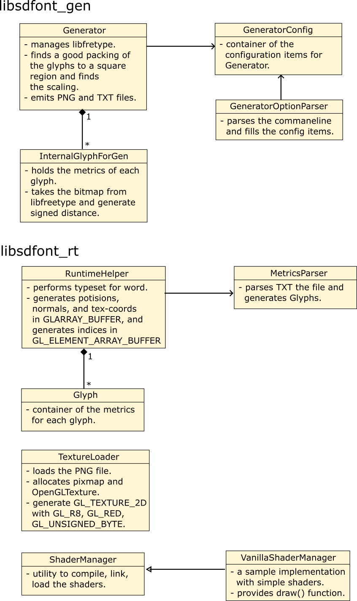
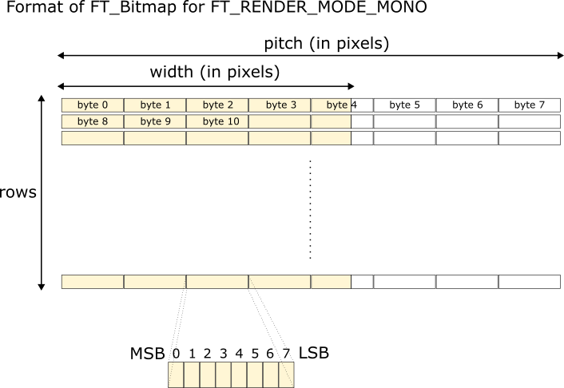

# SDFont : Signed Distance Font Generator and Runtime Utility

<a href="https://youtu.be/p1f0NFHqdbI"> </a>

A signed distant font generator and a runtime helper for OpenGL on Linux.
It utilizes TrueType fonts and FreeType library. SDFont comes with the following components:

* **libsdfont_gen**: The main library to generate signed distance fonts in PNG and the relevant metrics in TXT.

* **sdfont_commandline**: A small commandline tool that invokes the functionalities of **libsdfont_gen**.

* **libsdfont_rt**: The runtime helper library that loads the PNG file into OpenGL texture, parses the metrics TXT file into an array of *Glyph*s, typesets words. It also contains a bare-bone OpenGL shaders for convenience.

* **sdfont_demo**: A demo program that shows the opening roll of Star Wars.

[Demo Video](https://youtu.be/p1f0NFHqdbI) : A video capture of the opening crawl of Star Wars implemented in the demo program *sdfont_demo*.

**[For iOS and macOS](https://github.com/ShoYamanishi/SDFontApple)** :
another version of SDFont for iOS & macOS with Metal and CoreText can be found [here](https://github.com/ShoYamanishi/SDFontApple).

# Overview

This is an awesome technique for rendering typefaces by GPU.
It was originally proposed by Chris Green of Valve at SIGGRAPH 2007 [[PDF]](https://steamcdn-a.akamaihd.net/apps/valve/2007/SIGGRAPH2007_AlphaTestedMagnification.pdf).
In the normal font rendering by CPU, say, with FreeType, the shapes of the glyphs are stored in the vector graphics format (Bezier curves),
and at runtime, they are converted to a bitmap for a specific font size.

On the contrary, the technique for the signed distant fonts generates a texture for the glyphs in the signed distance representation,
in which the value of each pixel represents the distance from the closest glyph boundary.
The glyphs of the same typeface are usually packed into a single texture,
and each glyph gets the corresponding rectangular bounding box in the texture coordinates.
This texture generation is usually done as an off-line processing.
At runtime, the glyphs are rendered simply by quads specifying the bounding boxes in the texture uv-coordinates to the GPU.

There is another technique worth noting for rendering type faces in various sizes. 
This technique was proposed by Charles Loop and Jim Blinn of Microsoft
([paper](https://www.microsoft.com/en-us/research/wp-content/uploads/2005/01/p1000-loop.pdf)),
and used by [Figma](https://medium.com/@evanwallace/easy-scalable-text-rendering-on-the-gpu-c3f4d782c5ac).
With this technique, at runtime, each point in the glyph to be rendered by GPU is assigned a triangular region and the local coordinates (u,v) for the region.
The region defines a piece of bezier curve, and the GPU performs the in/on/out test of the curved region defined by bezier curve for each point.
It seems the runtime performance is pretty good, but the off-line processing of each glyph seems rather complicated, involving appropriate triangulation of each glyph.
This technique is on my to-do list, but it seems signed distance font performs as good as this technique.

Following are some samples rendered with a signed distance field font.
(Click to enlarge.)

<a href="docs/readme/Type0.png">
    
</a>
<a href="docs/readme/Type1.png">
    
</a>
<a href="docs/readme/Type6.png">
    
</a>

From left to right:
- Type 0: Raw output  by a pass-thru fragment shader.
- Type 1: Softened edge by smooth-step function.
- Type 2: The quads to which the signed distance glyphs are rendered.


# Benefits

* ✅Good visual quality for the wide range of font sizes with a single texture file. No noticeable jagged edges when magnified.

* ✅ Little overhead for rendering at runtime. No need to convert the vector graphics to a bitmap, as the glyphs have been in a way already rendered to the texture.

* ✅ Dynamic transformation of the typefaces at runtime. You can move, scale, rotate, sheer the typefaces just like the geometric transfomation for the other rendered objects.

* ✅ Typographic effects by the fragment shader. They can be achieved by applying a function to the sampled value from the signed distance texture. In the following sub-section you can see some sample effects with their corresponding fragment functions.

# Supported Environment

* Linux

* macOS (tested with Mac mini M1 2020 & Ventura 13.5.2)

# Reuirements

## General

* [Freetype](https://freetype.org) : used to access the true type fonts, to draw glyphs, and to obtain the font metrics.
* [LibGD](https://libgd.github.io) : used to handle raster graphics for the signed distance font glyphs.
* [LibPNG](http://www.libpng.org/pub/png/libpng.html) : used to read & write PNG files.

* [OpenGL](https://www.opengl.org) : used to render the fonts on the screen.
* [GLEW](https://glew.sourceforge.net) : a quasi requirement to use OpenGL.
* [GLFW3](https://www.glfw.org) : window manager for OpenGL.

Following is a sample installation process tested on Ubuntu 22.04.3 LTS.
```
sudo add-apt-repository universe
sudo add-apt-repository multiverse
sudo apt update
# The following three lines are apparently needed to make 'sudo apt-get build-dep' work.
# Ref: https://askubuntu.com/questions/496549/error-you-must-put-some-source-uris-in-your-sources-list
cat /etc/apt/sources.list | grep deb-src
sudo sed -i~orig -e 's/# deb-src/deb-src/' /etc/apt/sources.list
sudo apt-get update

sudo apt install build-essential
sudo apt install cmake
sudo apt-get build-dep libglfw3
sudo apt-get build-dep libglew-dev
sudo apt install libglew-dev
sudo apt install libglm-dev
sudo apt install libglfw3
sudo apt install libglfw3-dev
sudo apt install libfreetype-dev
sudo apt install libpng-dev
```

## Installing LibGD
The installation by the package managers such as apt and homebrew is missing or does not seem to work.
The best way to install LibGD seems to be to build and install it manually.
```
git clone https://github.com/libgd/libgd.git
cd libgd
git branch -l
* master
git log -n 1 --oneline
0d75136b (HEAD -> master, origin/master, origin/HEAD) add static qualifier to multiple functions
mkdir build
cd build
cmake .. -DCMAKE_BUILD_TYPE=Release
VERBOSE=1 make 2>&1 | tee make.log
VERBOSE=1 sudo make install 2>&1 | tee make_isntall.log
```

Please copy **FindGD.cmake** to the top directory of **SDFont**, where **CMakeLists.txt** resides.

```
# Find the location for FindGD.cmake
cd ..
find . -name "FindGD.cmake"
./cmake/modules/FindGD.cmake
cp ./cmake/modules/FindGD.cmake /path/to/your/SDFont
```

## Installing GLFW on MacOS.
On MacOS the requirements except for LibGD can be installed by [Homebrew](https://brew.sh).
However, the GLFW installed by Homebrew does not seem to work for me and I had to manually build it.
(The **glfwCreateWindow()** returns **nullptr** when it is linked with Homebrew's glfw library.)

```
$ git clone https://github.com/glfw/glfw.git
$ cd glfw
$ mkdir build
$ cd build
$ cmake -DCMAKE_BUILD_TYPE=Release .. 2>&1 | tee cmake_console_out.txt
$ VERBOSE=1 make 2>&1 | tee make.log
$ VERBOSE=1 sudo make install 2>&1 | tee make_install.log
```

# Build & Try
SDFont comes with two libraries and two executables.

* **libsdfont_gen** : library to generate signed distance fonts from the TrueType fonts.

* **libsdfont_rt** : small library to parse the font metrics and load the signed distance font glyph bitmap into a OpenGL texture.
It also contains a bare-bone convenience OpenGL shader.

* **sdfont_commandline** : a command-line tool to generate signed distance fonts. It interacts with libsdfont_lib.

* **sdfont_demo** : a demo program that shows the opening crawl of Star Wars.

They are built with the standard CMake process.

```
$ cd <path/to>/SDFont
# make sure you have copied FindGD.cmake.
$ ls FindGD.cmake
FindGD.cmake
$ mkdir build
$ cd build
$ cmake -DCMAKE_BUILD_TYPE=Release ..
$ VERBOSE=1 make
```

A sample signed distance font can be generated by the following command.
Please specify a correct path to a TrueType font to the option *-font_path* below.
The fonts are usually found in `/usr/share/fonts, /usr/local/fonts` etc on Linux, and `/System/Library/Fonts/` on MacOS.

```
./sdfont_commandline -locale en_US -verbose -font_path <path/to/truetype/fonts/such/as>/Helvetica.ttc -max_code_point 512 -texture_size 1024 -glyph_size_for_sampling 1024 -ratio_spread_to_glyph 0.2 signed_dist_font
```

This will generate two files: `signed_dist_font.png` and `signed_dist_font.txt`. The former contains the glyph shapes in signed distance in the gray scale 8-bit PNG format. It will be loaded at runtime to an OpenGL texture. The latter contains the metrics information useful for type setting.

To run the Star Wars demo, run the following command, and hit '*space*'.

```
./sdfont_demo signed_dist_font
```

# Usage

## Offline Font Generation with the Command-Line Tool

```
Usage: sdfont_generator -verbose -font_path [FontPath] -max_code_point [num] -texture_size [num] -glyph_size_for_sampling [num] -ratio_spread_to_glyph [float] -codepoint_range_file_path [FilePath] [output file name w/o ext]
```
* -verbose : Switch to turn on the verbose output.

* -font_path : Path to the TrueType font including the extention. The fonts are usually found in `/usr/share/fonts`, `/usr/local/fonts` etc. on Linux, and `/System/Library/Fonts/` on MacOS.

* -max_code_point [num] : The highest character code to process. Some fonts contain many glyphs, which are not used in most of the cases. If all the glyphs you use reside in the index range of 0-num, then you can specify num to reduce the number of glyphs to pack in the PNG file. For example, many fonts contains thousands of glyphs, but often times you use only the ones within [32-255]. In this case you can specify 255 to this option to process the glyphs only in the range of [0-255]. The default value is 255.

* -codepoint_range_file_path [FilePath] : The path to the file that contains the ranges of the character codes for which you want to generate glyphs. 
For example, if you want to get the glyphs for the Japanese katakanas and hiraganas, the file content would look like the following:
    ```
    # Range in [low, high + 1) format.

    # Hiragana: [U+3040, U+309F + 1)
    12352, 12448

    # Katakana: [U+30A0, U+30FF + 1)
    12448, 12544
    ```
    You don't have to specify this option if you want to get all the glyphs in the range of `[0, max_code_point)`.


* -texture_size [num] : The height and width of the PNG files in pixels. The default value is 512.

* -glyph_size_for_sampling [num] : The font size in pixels. The generator draws each glyph to a bitmap of this size to sample the signed distance. It affects the visual quality of the resultant signed distance font. The default value is 1024.

* -ratio_spread_to_glyph [float] : The extra margin around each glyph to sample and to accommodate the signed distance values tapering off. An appropriate range is 0.1 to 0.2. The default is 0.2.

* -enable_dead_reckoning : Experimental. Switch to enable the dead reckoning algorithm. See notes below.

* -reverse_y_direction_for_glyphs: Switch to reverse the vertical orientation of the glyphs in the PNG texture file. It's turned off by default. Turn it on, if you want to align the vertical direction of the glyphs in the texture to the direction of the rectangles in the vertices for rendering.

## NOTES on the Dead Reckoning Algorithm
The command-line switch *-enable_dead_reckoning* enables an implementation of the dead reckoning algorithm proposed by [Grevera](https://www.sciencedirect.com/science/article/abs/pii/S1077314204000682). It works like dynamic programming.
It assumes that for each point *v* on the grid on which the glyph is drawn, the closest point to the particular set of points has Bellman-equation like characteristics with respect to the neighbors of *v*. It works much faster than the original vicinity search algorithm. However, the quality of the output seems much worse.

After some investigation, it seems the difference in the quality comes from the fact that the dead reckoning algorithm does not find exactly the closet point of the opposite polarity, but only an approximation.

1. The dead reckoning algorithm first assigns zero at the points on the boundaries (i.e, the points for which at least one of the adjacent points has the opposite polarity), and assigns the nearest points to themselves. During the forward and backward scan, the polarity of each point is not taken into consideration.

2. There may be a case where the Bellman-equation like locality characteristics do not hold. In other words, the closest point could not always be calculated from its immediate neighbors.

This is inconclusive, and I need to investigate further, but external advice would be appreciated.


## Output PNG and TXT Files

### PNG Files

The output PNG file looks like the one shown below.
The format is PNG_COLOR_TYPE_GRAY with the depth of 8 bits.
It wll be loaded as a texture map at runtime.

<a href="docs/readme/sample_texture.png">

</a>

### TXT Files

The output TXT file consists of three parts:

* Margin

* Glyphs

* Kernings.


**Margin**

The Margin has the following two values that represent the orthogonal extent around each 
glyph in which the signed distance values taper off.
```
SPREAD IN TEXTURE
0.00488281
```
This value is in the normalized texture coordinate system.

```
SPREAD IN FONT METRICS
0.0973368
```
This value is in the font metrics coordinate system where the font size is assumed to be 1.0.

**Glyphs**

In Glyphs section, each line represents a glyph metrics.
The line consists of the following fields.

- Code Point
- Width
- Height
- Horizontal Bearing X
- Horizontal Bearing Y
- Horizontal Advance
- Vertical Bearing X
- Vertical Bearing Y
- Vertical Advance

The fields above are taken from the input TrueType font assuming the font size is 1.0.

- Texture Coord X : Left side of the glyph bit map in the texture coordinates.
- Texture Coord Y : Bottom side of the glyph bit map in the texture coordinates.
- Texture Width : Width of the bitmap in the texture coordinates.
- Texture Height : Height of the bitmap in the texture coordinates.

**Kernings**

This section represents the list of kernings for consecutive pairs of glyphs.
Each line represents the list of kearning for a particular preceeding glyph, which is specified in the first field in code points.
The rest of the line consists of the pairs of the succeeding glyph and the kerning.
The kerning values are taken from the input TrueType font assuming the font size is 1.0.

## Using the Signed Distance Fonts for Rendering.

At runtime, each glyph is drawn as a transformed textured quadrilateral (two triangles) on the screen by OpenGL.
The user gives the coordinates of the quadrilateral together with their
attributes such as the corresponding texture coordinates, normals and colors.

Therefore, you need to arrange buffer contents for GL_ARRAY_BUFFER and GL_ELEMENT_ARRAY_BUFFER for the draw call per frame, just like rendering the standard textured triangles.

You can make the buffer contents manually by consulting each Glyph object with `RuntimeHelper::getGlyph( long c )`.
Alternatively you can use a convenience type setter `RuntimeHelper::getMetrics()` for each word you want to render.

### Typesetting a Word with RuntimeHelper::getMetrics()

```
void RuntimeHelper::getMetrics(

    string            s,              // (in) word
    float             fontSize,       // (in) font size
    float&            width,          // (out) see below
    vector< float >&  posXs,          // (out) see below
    float&            firstBearingX,  // (out) see below
    float&            bearingY,       // (out) see below
    float&            belowBaseLineY, // (out) see below
    float&            advanceY,       // (out) see below
    vector< Glyph* >& glyphs          // (out) list of glyphs that corresponds the word.
);
```

This function gives the user some hints about the assignment of each glyph in the word local coordinate system.
It returns the data shown in the figure below.

<a href="docs/readme/typeset.png">

</a>

The positions above are for the glyph boundaries. However, when you render the glyphs you have to take the margin around each glyph in to account, in which the smooth transition from the inside of the glyph to the outside is handled.

### Generation of the OpenGL buffer contents with RuntimeHelper::generateOpenGLDrawElements()

```
void RuntimeHelper::generateOpenGLDrawElements (

    vector< Glyph* >& glyphs,         // (in) from getMetrics()
    vector< float >&  posXs,          // (in) from getMetrics()
    float             leftX,          // (in) the X position in the global coordinate system that corresponds to (0,0) in the figure above.
    float             baselineY,      // (in) the Y position in the global coordinate system that corresponds to (0,0) in the figure above.
    float             fontSize,       // (in) font size
    float             spreadRatio,    // (in) how much margin to give in the range if 0.0 to 1.0. This must be manually adjusted to get the best aesthetics.
    float             distribution,   // (in) horizontal distribution of each glyph. The value greater than 1.0 will elongate the positioning of each glyph, not the glyphs themselves.
    float             Z,              // (in) the Z-coordinate value.
    float*            arrayBuf,       // (out) the start address to which the buffer contents will be written.
    unsigned int      indexStart,     // (in) start index for the triangles for this word.
    unsigned int*     indices         // (out) the start address to which the indices will be written.
);
```
The contents of `arrayBuf` consist of the list of the following conceptual packed struct.
```
float3 pos    (x, y, Z)
float3 normal (0, 0, 1)
float2 uv texture-coordinates
```
For each glyph, 6 structs and 4 indices are generated for two triangles.


## Sample Shaders
**libsdfont_rt** provides a pair of vertex & fragment shaders.

### The vertex shader 
[shaders/VanillaSignedDistFontVertex.glsl](shaders/VanillaSignedDistFontVertex.glsl)
is a small 3D perspetcive projection shader.
This is a small function and it is easy to understand by looking at the code.


### The fragment shader 
[shaders/VanillaSignedDistFontFragment.glsl](shaders/VanillaSignedDistFontFragment.glsl)
is the main part and it takes care of the glyph rendering.
It has the following uniforms.

- fontTexture (sampler2D) : The ID (name) of the texture created from the PNG.

- effect (int) : type of face to be rendered. See the code above.

- useLight (bool) : set to true if light source specified by lightWCS is used.

- lowThreshold (float) : The threshold for the signed distance value used by type 2,3, and 4.
It is used to find the boundary between glyph and non-glyph pixels.

- highThreshold (float) : Another threshold used by type 4.
It is used to find the boundary for the inner curve for the hollow face.

- smoothing (float) : Smomothing parameter for the smooth step function.

- baseColor (vec3) :  Main color for the glyph.

- borderColor (vec3) : Secondary color for the glyph.

**NOTE:** Those shaders are baked into **libsdfont_rt as strings so that you don't have to read them as files at runtime.

# SDFont Implementation [WORK IN PROGRESS]

## Overview
Here's an overview of SDFont, which consists of three parts: 
    sdfont_commandline, libsdfont_gen, and libsdfont_rt.

<a href="docs/readme/overview.png">

</a>

## Class Diagrams

<a href="docs/readme/class_diagram.png">

</a>


## Font Generation

<a href="docs/readme/ft_bitmap_format.png">

</a>

# TODO

- Refine Implementation section.

# License

Copyright (c) 2019 Shoichiro Yamanishi

Wailea is released under MIT license. See `LICENSE` for details.

# Contact

For any inquiries, please contact:
Shoichiro Yamanishi

yamanishi72@gmail.com

# Reference

* [Green07]
Chris Green. 2007. Improved alpha-tested magnification for vector textures and special effects. In ACM SIGGRAPH 2007 courses (SIGGRAPH '07). ACM, New York, NY, USA, 9-18. DOI: https://doi.org/10.1145/1281500.1281665

* [Grevera2004]
George J Grevera, The “dead reckoning” signed distance transform, Computer Vision and Image Understanding, Volume 95, Issue 3, 2004, Pages 317-333, ISSN 1077-3142, https://doi.org/10.1016/j.cviu.2004.05.002.