# SDFont : Signed-Distance Font Generator and Runtime Utility

<a href="https://youtu.be/p1f0NFHqdbI"> </a>


A signed-distance font generator and a runtime helper for OpenGL on Linux and Macos.
It utilizes TrueType fonts and FreeType library. SDFont comes with the following components:

* **libsdfont_gen**: The main library to generate signed-distance fonts in PNG and the relevant metrics in TXT.

* **sdfont_commandline**: A small command-line tool that invokes the functionalities of **libsdfont_gen**.

* **libsdfont_rt**: The runtime helper library that loads the PNG file into OpenGL texture, parses the metrics TXT file into an array of *Glyph*s, and typesets words. It also contains a bare-bone OpenGL shaders for convenience.

* **sdfont_demo**: A demo program that shows the opening roll of Star Wars.

[Demo Video](https://youtu.be/p1f0NFHqdbI) : A video recording of the opening crawl of Star Wars implemented in the demo program *sdfont_demo*.

**[SDFontApple for iOS and macOS](https://github.com/ShoYamanishi/SDFontApple)** :
another version of SDFont for iOS & macOS with Metal and CoreText.


# Table Of Contents

- [Overview](#overview)
- [Benefits](#benefits)
- [Supported Environment](#supported-environment)
- [Requirements](#requirements)
- [Build & Install](#build--install)
- [Usage of the Commandline Generator](#usage-of-the-commandline-generator)
- [PNG & TXT File: Output of the sdfont_commandline](#png--txt-file-output-of-the-sdfont_commandline)
    - [PNG File](#png-file)
    - [Interpretation of the Pixel Values in the PNG File](#interpretation-of-the-pixel-values-in-the-png-file)
    - [TXT File](#txt-file)
- [Using the Signed-Distance Fonts for Rendering](#using-the-signed-distance-fonts-for-rendering)
    - [Rendering a Single Character](#rendering-a-single-character)
    - [Rendering a Word](#rendering-a-word)
    - [Typesetting a Sentence](#typesetting-a-sentence)
    - [Loading the PNG File as Texture](#loading-the-png-file-as-texture)
- [Using RuntimeHelper](#using-runtimehelper)
    - [Creating a RuntimeHelper](#creating-a-runtimehelper)
    - [Obtaining Metrics from RuntimeHelper](#obtaining-metrics-from-runtimehelper)
    - [Obtaining the Glyph Origins, Width, and Height](#obtaining-the-glyphorigins-width-and-height)
    - [Obtaining the Bounding Boxes for Vertices and Texture](#obtaining-the-bounding-boxes-for-vertices-and-texture)
    - [Generating Vertex Array](#generating-vertex-array)
- [Internal Design](#internal-design--implementation-work-in-progress)
- [To-Do](#todo)
- [License](#license)
- [Contact](#contact)
- [Reference](#reference)
- [Appendices](#appendices)
    - [Notes on the Dead-Reckoning Algorithm](#appendix-a-notes-on-the-dead-reckoning-algorithm)
    - [Using Gaussian Blur for Font Rendering](#appendix-b-using-gaussian-blur-for-font-rendering)

# Overview

This is a great technique for rendering typefaces by GPU.
It was originally proposed by Chris Green of Valve at SIGGRAPH 2007 [[PDF]](https://steamcdn-a.akamaihd.net/apps/valve/2007/SIGGRAPH2007_AlphaTestedMagnification.pdf).
In the normal font rendering by CPU, say, with FreeType, the shapes of the glyphs are stored in the vector graphics format (Bezier curves),
and at runtime, they are converted to a bitmap for a specific font size.

On the contrary, the technique for the signed distant fonts generates a texture for the glyphs in the signed distance representation,
in which the value of each pixel represents the distance from the closest glyph boundary.
The glyphs of the same typeface are usually packed into a single texture,
and each glyph gets the corresponding rectangular bounding box in the texture coordinates.
This texture generation is usually done as an off-line processing.
At runtime, the glyphs are rendered simply by quads specifying the bounding boxes in the texture uv-coordinates to the GPU.

There is another technique worth noting for rendering type faces in various sizes. 
This technique was proposed by Charles Loop and Jim Blinn of Microsoft
([paper](https://www.microsoft.com/en-us/research/wp-content/uploads/2005/01/p1000-loop.pdf)),
and used by [Figma](https://medium.com/@evanwallace/easy-scalable-text-rendering-on-the-gpu-c3f4d782c5ac).
With this technique, at runtime, each point in the glyph to be rendered by GPU is assigned a triangular region and the local coordinates (u,v) for the region.
The region defines a piece of bezier curve, and the GPU performs the in/on/out test of the curved region defined by bezier curve for each point.
It seems the runtime performance is pretty good, but the off-line processing of each glyph seems rather complicated, involving appropriate triangulation of each glyph.
This technique is on my to-do list, but it seems signed distance font performs as good as this technique.

Following are some samples rendered with a signed distance field font.
(Click to enlarge.)

<a href="docs/readme/Type0.png">
    
</a>
<a href="docs/readme/Type1.png">
    
</a>
<a href="docs/readme/Type6.png">
    
</a>

From left to right:
- Type 0: Raw output  by a pass-thru fragment shader.
- Type 1: Softened edge by smooth-step function.
- Type 2: The quads to which the signed distance glyphs are rendered.


# Benefits

* ✅Good visual quality for a wide range of font sizes with a single texture file. No noticeable jagged edges when magnified.

* ✅ Little overhead for rendering at runtime. No need to convert the vector graphics to a bitmap, as the glyphs have been in a way already rendered to the texture.

* ✅ Dynamic transformation of the typefaces at runtime. You can move, scale, rotate, sheer the typefaces just like the geometric transfomation for the other rendered objects.

* ✅ Typographic effects by the fragment shader. They can be achieved by applying a function to the sampled value from the signed-distance texture. In the following sub-section you can see some sample effects with their corresponding fragment functions.

# Supported Environment

* Linux

* macOS (tested on Mac mini M1 2020 & Ventura 13.5.2)

# Reuirements

## General

* [Freetype](https://freetype.org) : used to access the TrueType fonts, to draw glyphs, and to obtain the font metrics.
* [LibPNG](http://www.libpng.org/pub/png/libpng.html) : used to read & write PNG files.

* [OpenGL](https://www.opengl.org) : used to render the fonts on the screen.
* [GLEW](https://glew.sourceforge.net) : a quasi requirement to use OpenGL.
* [GLFW3](https://www.glfw.org) : a window manager for OpenGL used in the demo program.

* [utfcpp](https://github.com/nemtrif/utfcpp) : a library to manipulate strings in unicode developed by [Nemanja Trifunovic](https://github.com/nemtrif) provided under BSL-1.0 license. It is already included in [include/utfcpp](include/utfcpp/).


Following is a sample installation process tested on Ubuntu 22.04.3 LTS.
```
sudo add-apt-repository universe
sudo add-apt-repository multiverse
sudo apt update
# The following three lines are apparently needed to make 'sudo apt-get build-dep' work.
# Ref: https://askubuntu.com/questions/496549/error-you-must-put-some-source-uris-in-your-sources-list
cat /etc/apt/sources.list | grep deb-src
sudo sed -i~orig -e 's/# deb-src/deb-src/' /etc/apt/sources.list
sudo apt-get update

sudo apt install build-essential
sudo apt install cmake
sudo apt-get build-dep libglfw3
sudo apt-get build-dep libglew-dev
sudo apt install libglew-dev
sudo apt install libglm-dev
sudo apt install libglfw3
sudo apt install libglfw3-dev
sudo apt install libfreetype-dev
sudo apt install libpng-dev
```

## Installing GLFW on MacOS.
On MacOS the requirements can be installed by [Homebrew](https://brew.sh).
However, the GLFW installed by Homebrew does not seem to work for me and I had to manually build it.
(The **glfwCreateWindow()** returns **nullptr** when it is linked with Homebrew's glfw library.)

```
$ git clone https://github.com/glfw/glfw.git
$ cd glfw
$ mkdir build
$ cd build
$ cmake -DCMAKE_BUILD_TYPE=Release .. 2>&1 | tee cmake_console_out.txt
$ VERBOSE=1 make 2>&1 | tee make.log
$ VERBOSE=1 sudo make install 2>&1 | tee make_install.log
```

# Build & Install
SDFont comes with two libraries and two executables.

* **libsdfont_gen** : library to generate signed distance fonts from the TrueType fonts.

* **libsdfont_rt** : small library to parse the font metrics and load the signed distance font glyph bitmap into a OpenGL texture.
It also contains a bare-bone convenience OpenGL shader.

* **sdfont_commandline** : a command-line tool to generate signed distance fonts. It interacts with libsdfont_gen.

* **sdfont_demo** : a demo program that shows the opening crawl of Star Wars.

They are built with the standard CMake process.

```
$ cd <path/to>/SDFont
$ mkdir build
$ cd build
$ cmake -DCMAKE_BUILD_TYPE=Release ..
$ VERBOSE=1 make
```

A sample-signed distance font can be generated by the following command.
Please specify a correct path to a TrueType font to the option *-font_path* below.
The fonts are usually found in `/usr/share/fonts, /usr/local/fonts` etc on Linux, and `/System/Library/Fonts/` on MacOS. The demo program was tested with the normal Helvetica font.

```
./sdfont_commandline -verbose -font_path <path/to/truetype/fonts/such/as>/Helvetica.ttc -max_code_point 512 -texture_size 512 -glyph_size_for_sampling 512  -num_threads 16 signed_dist_font
```

This will generate two files: `signed_dist_font.png` and `signed_dist_font.txt`. The former contains the glyph shapes in signed distance in the gray scale 8-bit PNG format. It will be loaded at runtime to an OpenGL texture. The latter contains the metrics information useful for typesetting.

To run the Star Wars demo, run the following command. Hit '*space*' to start the animation.

```
./sdfont_demo signed_dist_font
```

# Usage of the Commandline Generator
It takes a vector TrueType font (usually the extension is `.ttf` or `.ttc`, and generates a signed-distance font. 

**NOTE:** Ligatures are not supported at moment. I could not figure out if/how I handle ligatures with libfreetype. If you know how, I would appreciate your advice.

```
Usage: sdfont_commandline -verbose -font_path [FontPath] -process_hidden_glyphs [highest codepoint] -char_code_range 0X********-0X******** (can be specified multiple times) -texture_size [num] -glyph_size_for_sampling [num] -ratio_spread_to_glyph [float] -num_threads [num 1-32] [output file name w/o ext]
```
* -verbose : Switch to turn on the verbose output.

* -font_path : Path to the TrueType font including the extention. The fonts are usually found in `/usr/share/fonts`, `/usr/local/fonts` etc. on Linux, and `/System/Library/Fonts/` on MacOS.

* -process_hidden_glyphs : Processes hidden glyphs that are not reachable from any character maps included in the original font. For example, 'Computer Modern' fonts have a few thousand glyphs (mostly math symbols) defined but not accessible from any character maps. This option enables the generation of the signed distance data for those glyphs.

* -char_code_range [0X********-0X********] : This option can be specified multiple times. If this option is present, it proceeses the glyphs that correspond to the character codes in the specified ranges only.

* -texture_size [num] : The height and width of the PNG files in pixels. The default value is 512. It  should be a power of 2, as most of the OpenGL implementations do not accept the textures of different sizes.

* -glyph_size_for_sampling [num] : The font size in pixels. The generator draws each glyph to a bitmap of this size to sample the signed distance. It affects the visual quality of the resultant signed distance font. The default value is 1024.

* -ratio_spread_to_glyph [float] : The extra margin around each glyph to sample and to accommodate the signed distance values tapering off. An appropriate range is 0.1 to 0.2. The default is 0.2.

* -num_threads [num 1-32] : The number of threads used for the vicinity search.

* -enable_dead_reckoning : Experimental. Switch to enable the dead reckoning algorithm for faster processing. See [Appendix A](#appendix-a-notes-on-the-dead-reckoning-algorithm).

# PNG & TXT File: Output of the `sdfont_commandline`.
The output consits of two files: PNG that represents the signed-distance field of each glyph, and an accompanying TXT file that contains the metrics of the fonts necessary to render the glyphs at runtime.

## PNG File
The output PNG file is a 2-dimensional gray scale image (*PNG_COLOR_TYPE_GRAY*), where each pixel in unsigned byte (*depth:8*) represents the quantized value sampled at the regular grid points in the signed-distance field.
The PNG file looks like the one shown below.

<a href="docs/readme/sd_font.png">
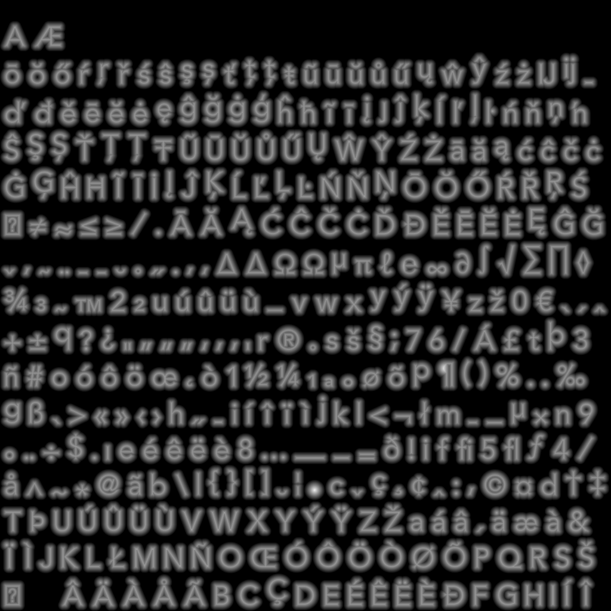
</a>

It wll be loaded as a texture map at runtime. With OpenGL, it can be loaded with the following
parameters for `glTexImage2D`.

```
glTexImage2D( GL_TEXTURE_2D,
              0,
              GL_R8,
              <width>,
              <width>,
              0,
              GL_RED,
              GL_UNSIGNED_BYTE,
              <pixmap>            );
```

## Interpretation of the Pixel Values in the PNG File.
The meaning of the pixel values in the signed distance PNG file can be explained
by the following simplified generation process along a horizontal line across
which a perpendicular beam is laid out. The black beam is part of the glyph drawn in the bitmap.

<a href="docs/readme/value_calculation.png">
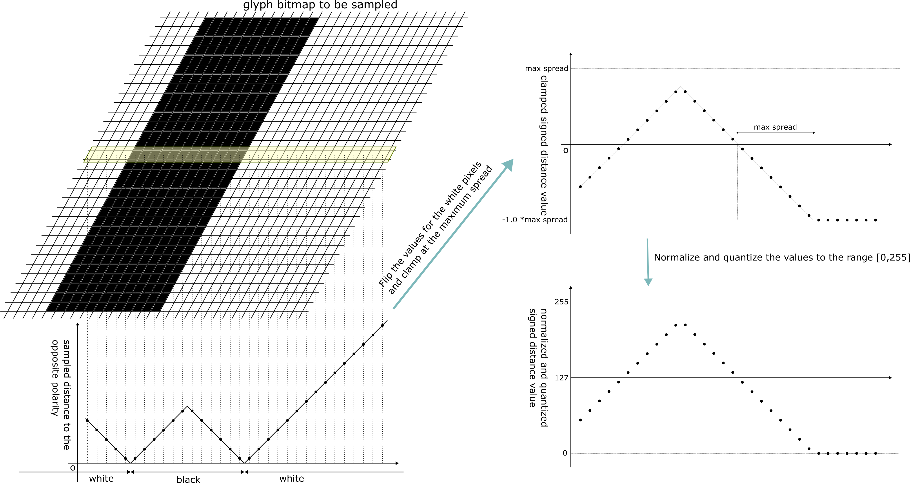
</a>

The top left image shows a part of the glyph drawn in a high resolution bitmap.
The image can be divided into two polarities: black(inked) parts and the white parts.
We sample the distance along the horizontal line designated with the yellow shade.
The bottom left graph shows the minimum distance to the opposite polarity and sampled points at the regular interval on the grid points.
As you can see, the minimum distance vanishes at the boundary between black and white.
We then flip the sampled value for the white parts by multiplying them by -1. We also clamp the value at the specified value determined by the parameter `-ratio_spread_to_glyph` of `sdfont_commandline`.
Those values are shown in the top right graph. 
Finally we normalize and quantize those values in the range of [0,255].
Those are the final signed distance values in the PNG file as the gray scale, which can be visualized as a blurred gray image.
Those vlaues are shown in the bottom right.

**NOTE:** The signed-distance value at each discrete grid point could be calculated analytically from the vector representation, i.e., from the parametric representation of the set of the Bezier curves. However, the implemetation would involve complex geometric in/out tests or winding number tests, and would be prone to errors, especially for the degenerate cases. This tool takes a much naive and simpler approach of drawing the glyphs in the high-resolution bitmaps and finds a closest pixel of the opposite polarity [black/white] from each pixel with a simple grid search. )


## TXT File

The output TXT file consists of three sections: Spread, Glyphs, and Kerning.

**Spread**

The Spread section has the following two values that represent the maximum spread around each 
glyph.

```
SPREAD IN TEXTURE
0.00488281
```
This value is in the uv-texture coordinate system.

```
SPREAD IN FONT METRICS
0.0973368
```
This value is in the font-metrics coordinate system with **the font size assumed to be 1.0 pixel**.

**Glyphs**

In Glyphs section, each line represents the metrics for a glyph.
One line consists of the following fields.

- Code Point
- Glyph Name
- Width
- Height
- Horizontal Bearing X
- Horizontal Bearing Y
- Horizontal Advance
- Vertical Bearing X
- Vertical Bearing Y
- Vertical Advance

- Texture Coord X : Left side of the glyph bit map in the texture coordinates.
- Texture Coord Y : Bottom side of the glyph bit map in the texture coordinates.
- Texture Width : Width of the bitmap in the texture coordinates.
- Texture Height : Height of the bitmap in the texture coordinates.

The second to the ninth fields are in the font-metrics coordinate system with **the font size assumed to be 1.0 pixel**.
The last 4 values are in the uv-texture coordinate system.

**Kerning**

The Kerning section has the list of kerning values for the ordered consecutive pairs of glyphs.
Each line represents the list of kearning for a particular preceeding glyph, which is specified in the first field in code points.
The rest of the line consists of the pairs of the immediately following glyph and the kerning.
The kerning values in the font-metrics coordinate system with **the font size assumed to be 1.0 pixel**.

# Using the Signed-Distance Fonts for Rendering.

Using the signed-distance font is a bit involved. The rendering itself is a simple process of drawing a quad (two adjacent triangles) per glyph. However, calculating the correct vertex positions and uv texture coordinates are not straightforward.
We first look at rendering a single character independently, and then move on to rendering a word with the typesetting.

First, let's denote the local coordinate system in which the glyph is rendered by **render coordinate system**, or **RCS**. The points in RCS are transformed into the world coordinate system, or WCS by the model matrix, and then to the device coordinate system by the view and projection matrices in the vertex shader.


## Rendering a Single Character.
First, let's focus on renderin a single character 'g'.
The code point of 'g' in all the known encodings is 103 (0x67).
You will find something like the following in the TXT file.

| Code Point | Glyph Name | Width | Height | Horizontal Bearing X | Horizontal Bearing Y | Horizontal Advance | Vertical Bearing X | Vertical Bearing Y | Vertical Advance | Texture Coord X | Texture Coord Y | Texture Width | Texture Height |
| :--: | :--: | :--: | :--: | :--: | :--: | :--: | :--: | :--: | :--: | :--: | :--: | :--: | :--: |
| 103 | Ccedilla | 0.458984 | 0.757812 | 0.0292969 | 0.536133 | 0.556641 | -0.249023 | 0.0810547 | 0.919922 | 0.361328 | 0.641602 | 0.0386015 | 0.0637336 |

| SPREAD IN TEXTURE | SPREAD IN FONT METRICS |
| :--: | :--: |
| 0.0166016 | 0.197398 |

The first step is to retrieve the relevant information in the uv-texture coordinate system from the texture file. We need to use the following values.

-  Texture Coord X (0.361328)
-  Texture Coord Y (0.641602)
-  Texture Width (0.0386015)
-  Texture Height (0.0637336)
-  SPREAD IN TEXTURE (0.0166016)

Those values can be retrieved through the API as follows.

```
SDFont::RuntimeHelper& helper;
const SDFont::Glyph* g = helper.getGlyph( 103 );
```

- `g->mTextureCoordX;`
- `g->mTextureCoordY;`
- `g->mTextureWidth;`
- `g->mTextureHeight;`
- `helper.spreadInTexture();`

Schematically the relevant parts in the texture can be shown in the pale-blue and the amber rectangular boundaries on the left side of the following figure.

&nbsp;

<a href="docs/readme/single_char.png">
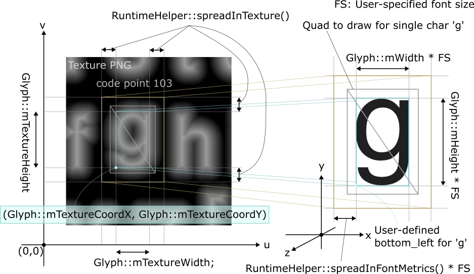
</a>

&nbsp;

The blue rectangle represents the glyph boundary in the original font, i.e., the mimimal (tightest) rectangle to enclose the glyph shape. It is specified by the texture coord x & y, and texture width & height.
If we used the blue rectangle for drawing the glyph 'g' for rendering, you might not get the correct shape near the rectangular boundary. Especially, if you want some blurred rendering, say, with the smooth step function in the shader, you have to expand the rectangle a little bit. To what extent depends on the type of the rendering effect used in the fragment shader, and the maximum allowed extent is given by `spreadInTexture()`. This value is inherent to the signed distance font generated by `sdfont_commandline`, and controlled by the parameter `-ratio_spread_to_glyph`. The rectangle with the maximum spread is shown in amber.

As a hint to build quad vertices for rendering in RCS, you can use the following metrics.

- Width (0.757812)
- Height (0.0292969)
- SPREAD IN FONT METRICS (0.197398)

Those values can be retrieved through the API as follows.

- `g->mWidth;`
- `g->mHeight;`
- `helper.spreadInFontMetrics();`

Those values are proportional to the values for the textures above, but scaled for the unit font size (the font size of 1.0 pixel).

We have now gathered enough information to render 'g' at your desirable location in RCS, font size, and the spread.
The following code snippet exemplifies the construction of the vertex arrays to render 'g' at (1, 3) for the bottom-left corner, the font size 5, and the spread of 40% (the normal and the color components are omitted for clarity).

```
struct VertexObject {

    float vertex_x;
    float vertex_y;
    float vertex_z;
    float vertex_w;
    float texture_u;
    float texture_v;
    float __pad__;
    float __pad__;
};

struct Point2D {

    float mX;
    float mY;

    Point2D( const float x, const float y ):mX{x},mY{y}{}
};

const float font_size = 5.0f;
const Point2D bottom_left( 1.0f, 3.0f );

// expand the rectangle to include 40% of the maximum spread.
const float spread_texture = runtime_helper.spreadInTexture() * 0.4f;
const float spread_vertex = runtime_helper.spreadInFontMetrics() * 0.4f;

VertexObject a[4];

// bottom left
a[0].vertex_x = bottom_left.mX - spread_vertex * font_size;
a[0].vertex_y = bottom_left.mY - spread_vertex * font_size;
a[0].vertex_z = 0.0f;
a[0].vertex_w = 1.0f;
a[0].texture_u = g->mTextureCoordX - spread_texture;
a[0].texture_v = g->mTextureCoordY - spread_texture;

// bottom right
a[1].vertex_x = bottom_left.mX + ( g->mWidth + spread_vertex ) * font_size;
a[1].vertex_y = bottom_left.mY - spread_vertex * font_size;
a[1].vertex_z = 0.0f;
a[1].vertex_w = 1.0f;
a[1].texture_u = g->mTextureCoordX + g->mTextureWidth + spread_texture;
a[1].texture_v = g->mTextureCoordY - spread_texture;

// top right
a[2].vertex_x = bottom_left.mX + ( g->mWidth + spread_vertex ) * font_size;
a[2].vertex_y = bottom_left.mY + ( g->mHeight + spread_vertex ) * font_size;
a[2].vertex_z = 0.0f;
a[2].vertex_w = 1.0f;
a[2].texture_u = g->mTextureCoordX + g->mTextureWidth + spread_texture;
a[2].texture_v = g->mTextureCoordY + g->mTextureHeight + spread_texture;

// top left
a[3].vertex_x = bottom_left.mX - spread_vertex * font_size;
a[3].vertex_y = bottom_left.mY + ( g->mHeight + spread_vertex ) * font_size;
a[3].vertex_z = 0.0f;
a[3].vertex_w = 1.0f;
a[3].texture_u = g->mTextureCoordX - spread_texture;
a[3].texture_v = g->mTextureCoordY + g->mTextureHeight + spread_texture;
```

## Rendering a Word

In this section, we focus on the western horizontal left-to-right writing system.
When you render a word, which consists of multiple glyphs,
you render multiple quads and you have to take care of the relative positions among the quads in RCS.
You may also have to find the size of the rectangular area in RCS required to accommodate the quads beforehand.
Those relative positions are given by the font designers to the users through the font metrics.
We need to user 4 more types of the metrics as follows.

- Horizontal Bearing X (0.0292969)
- Horizontal Bearing Y (0.536133)
- Horizontal Advance (0.556641)
- Vertical Advance (0.919922)

Again, those values in the font-metrics coordinate system with the unit font size.
Those values can be retrieved through the API as follows.

- `g->mHorizontalBearingX;`
- `g->mHorizontalBearingY;`
- `g->mHorizontalAdvance;`
- `g->mVerticalAdvance;`

To understand those values, we need to introduce the concept of 'glyph origin' per instance of glyph.
Those values are defined with respect to the glyph origins.
The definition of the glyph origin and the horizontal bearings X & Y can be explained with the following figure. Please note that the bearings are directional, meaning positive values indicate the bearings are leftward along X and upward along Y.

&nbsp;

<a href="docs/readme/multichars_01.png">
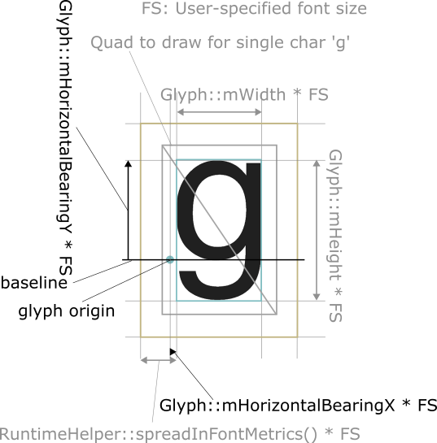
</a>

&nbsp;
As you can see, the horizontal bearing defines the relative position of the left edge of the glyph boundary to the glyph origin, and the vertical bearing defines the relative position of the top edge.

And the horizontal & vertical advances define the relative positions among the instances of the glyphs with respect to the glyph origins as follows. Apparently the vertical advance is the same value for all the glyphs in the font.

&nbsp;

<a href="docs/readme/multichars_02.png">
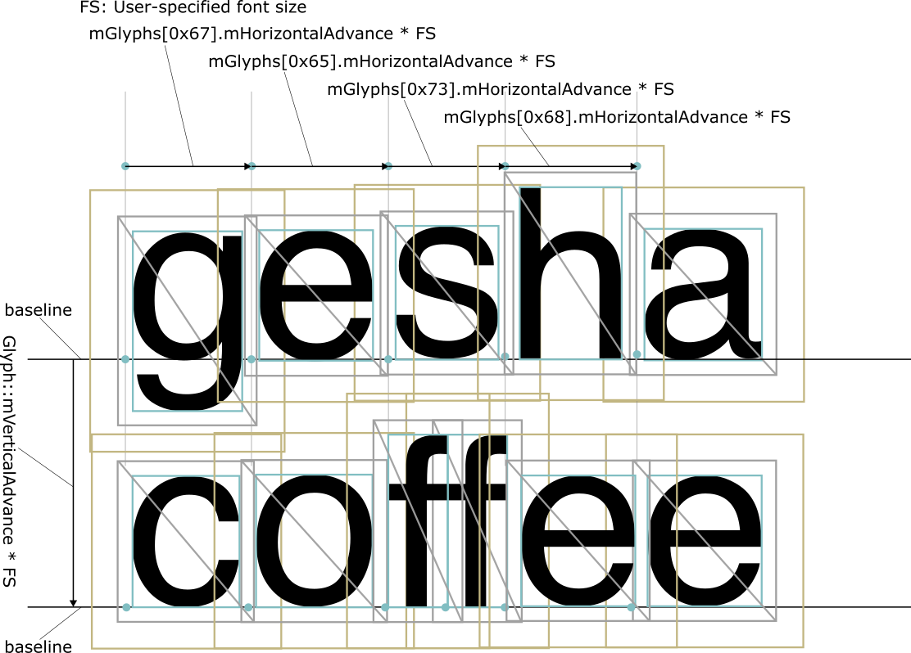
</a>

&nbsp;

The process of finding the positions for the quads in RCS for the glyphs in a word would then look like the following. Assume the number of glyphs for the word is *NUM_GLYPHS*.

1. Choose the baseline Y `b_y` and the left position X `L_x`, along which the left side of the glyph boundary in pale-blue bgets aligned in RCS. Also choose the fontsize to `font_size`.

2. Find the glyph origin for the first glyph in the RCS to `instance_origin[0]`. 

```
const Glyphs* (glyphs[NUM_GLYPHS]); // arranged according to the glyphs in the given word.

Point2D instance_origins[NUM_GLYPHS]; // glyph origins.

instance_origins[0].mY = b_y;
instance_origins[0].mX = L_x - glyphs[0]->mHorizontalBearingX * font_size;
```

3. From the position of the glyph origin for the first glyph, find the positions of the glyph origins in the RCS for the rest of the glyphs with the horizontal advances. If you want to alter the spacing among the letters in the word, you can specify the spacing like the *letter-spacing* property in CSS.

```
const float letter_spacing = 1.0f; // default;

for ( int i = 1; i < NUM_GLYPHS; i++ ) {

    instance_origins[i].mY = b_y;
    instance_origins[i].mX = instance_origins[i-1].mX
                           + glyphs[i-1]->mHorizontalAdvance * font_size * letter_spacing;
}

```
Now we have found all the glyph origins in `instance_origins[].
From the glyph origins, we can then find the position for the bottom-left corner of the glyph boundary (pale-blue) for each glyph as follows.

4. Find the bottom-left corner of the pale-blue boundaries from the glyph origins found at the step 3.

```
Point2D bottom_left[NUM_GLYPHS];

for ( int i = 0; i < NUM_GLYPHS; i++ ) {

    bottom_left[i].mX = instance_origins[i].mX + glyphs[i]->mHorizontalBearingX * font_size;

    bottom_left[i].mY = instance_origins[i].mY 
                      + ( glyphs[i]->mHorizontalBearingY - glyphs[i]->mHeight ) * font_size;
}
```

After finding the `bottom_left` point for each glyph in RCS, we can use the process described in 
[Rendering a Single Character](#rendering-a-single-character).

If you want to find the width and the height for the rectangular space to accommodate 
all the glyph bounding boxes in RCS, for example, if you want to align the drawing to 
the center of the parent region, then you can use the following.

```
const auto width = bottom_left[NUM_GLYPHS-1].mX 
                 + glyphs[NUM_GLYPHS-1].mWidth * font_size - bottom_left[0].mX 

const auto height_above_baseline = 0.0f;
const auto height_below_baseline = 0.0f;

for ( int i = 0; i < NUM_GLYPHS; i++ ) {

    const auto above_baseline = glyphs[i]->mHorizontalBearingY; 
    const auto below_baseline = glyphs[i]->mHeight - glyphs[i]->mHorizontalBearingY;

    height_above_baseline = std::max( height_above_baseline, above_baseline );
    height_below_baseline = std::max( height_below_baseline, below_baseline );
}

const auto height = height_above_baseline + height_below_baseline;

```

## Typesetting a Sentence

From the words, you can construct a sentence. It involves the spacing between two adjacent words.
The runtime helper does not provide any functionality to typeset a sentence,
as it involves many factors such as sentence breaks, alignment, aesthetics, and the preference of the readers.
One way to deal with the word spacing is to use the horizontal advancement for the character ' ' (0x20). A sentence may span multiple lines. The distance between two vertically adjacent baselines can be found by `Glyph::mVerticalAdvance * font_size`.

## Typesetting with Kerning and Ligatures

The kerning is defined in some fonts.
With kerning you can fint-tune the letter-spacing between two adjacent glyphs depending on the combination of the adjacent code points. For example, you can juxtapose 'W' and 'A' closer. 
The kerning is usually defined only for a few combinations of two code point pairs.

The step 3 above to find the glyph origins can be altered to include kerning as follows.

```
const float letter_spacing = 1.0f; // default;

for ( int i = 1; i < NUM_GLYPHS; i++ ) {

    float kerning = 0.0;

    const auto it = glyphs[i-1].mKernings.find( glyphs[i].mCodepoint );

    if ( it != glyphs[i-1].mKernings.end() ) {
        
        // kerning is defined between glyphs[i-1].mCodePoint and glyphs[i].mCodePoint.
        kerning = it->second;
    }

    instance_origins[i].mY = b_y;
    instance_origins[i].mX = ( glyphs[i-1]->mHorizontalAdvance + kerning )
                           * font_size
                           * letter_spacing;
}
```

Ligature is not supported in the current version.
This is mainly due to the fact that I could not find how to use ligature with `libfreetype`.
If you know how, I would appreciate your help.

## Loading the PNG File as Texture.

You can load the PNG file as a 2D texture normally with the linear interpolation as follows.

```
    glTexImage2D( GL_TEXTURE_2D,
                  0,
                  GL_R8,
                  mWidth,
                  mWidth,
                  0,
                  GL_RED,
                  GL_UNSIGNED_BYTE,
                  mPixMap            );

    glTexParameterf( GL_TEXTURE_2D, GL_TEXTURE_WRAP_S,     GL_REPEAT  );
    glTexParameterf( GL_TEXTURE_2D, GL_TEXTURE_WRAP_T,     GL_REPEAT  );
    glTexParameterf( GL_TEXTURE_2D, GL_TEXTURE_MAG_FILTER, GL_LINEAR  );
    glTexParameterf( GL_TEXTURE_2D, GL_TEXTURE_MIN_FILTER, GL_LINEAR  );
```

Please see the code [texture_loader.cpp](https://github.com/ShoYamanishi/SDFont/src_lib_runtime_helper/texture_loader.cpp) as a reference with libpng and OpenGL.

In the fragment shader, for each rasterized pixel, you can retrieve the interpolated signed distance
value as follows. The following sample code is for rendering normal glyphs with sharp edges.
You can make various typographic effects using the sampled signed_distance value.
For example, applying `smoothstep()` function to obtain some blur & halo effects.

```
in vec2 texCoordOut;

uniform sampler2D fontTexture;
uniform float     threshold;
uniform vec3      baseColor;

void main (void) {

    // interpolated signed-distance value.
    float signed_distance = texture( fontTexture, texCoordOut ).r;

    if ( alpha >= threshold ) {

        color.rgb = baseColor;
        color.a   = 1.0;
    }
    else {

        color.rgb = baseColor;
        color.a   = 0.0;
    }

}
```

&nbsp;&nbsp;&nbsp;

# Using RuntimeHelper

To use the runtime helper, include the following header file.

```
#include "sdfont/runtime_helper/runtime_helper.hpp"
```

## Creating a RuntimeHelper

Specify the font path without the extention (.png, .txt) to the constructor.

```
auto helper = SDFont::RuntimeHelper( <path/to/signeddistance/font/wo/extention> );
```

## Obtaining Metrics from RuntimeHelper

### Spreads
```
/** @brief spread in lengths in the uv-texture coordinates.
 */
float spreadInTexture() const;

/** @brief spread in pixels in the font metrics. */
float spreadInFontMetrics() const;
```

### Per-Glyph Metrics

```
/** @brief
 *
 *  @param c (in): code point
 *
 *  @return pointer to Glyph that constains the metrics.
 *          nullptr if the given code point is not valid.
 */
const Glyph* getGlyph( const long c ) const;
```

The Glyph structure is defined in `sdfont/glyph.hpp`.

```
class Glyph {

  public:

    long  mCodePoint;
    float mWidth;
    float mHeight;
    float mHorizontalBearingX;
    float mHorizontalBearingY;
    float mHorizontalAdvance;
    float mVerticalBearingX;
    float mVerticalBearingY;
    float mVerticalAdvance;
    float mTextureCoordX;
    float mTextureCoordY;
    float mTextureWidth;
    float mTextureHeight;

    std::string mGlyphName;
    /*
     *  key:   code point
     *  value: kerning
     */
    std::map< long, float > mKernings;

};
```


## Obtaining the GlyphOrigins, Width, and Height.

```
    /** @brief typesets a word.
     *
     *  @param s               (in):  the word to typeset in the unicode sequence.
     *
     *  @param charMapIndex    (in):  index into the character maps.
     *                                set to -1 if you want to use the default map.
     *
     *  @param fontSize        (in):  font size in pixels.
     *
     *  @param letterSpacing   (in):  letter spacing similar to letter-spacing 
     *                                property in CSS. Use 1.0 as the base value.
     *                                If you want to stretch the spacing by 10%, then
     *                                set 1.1.
     *
     *  @param leftX           (in):  the X-coordinate to which the left
     *                                edge of the bounding box of the first glyph
     *                                is aligned in the render coordinate system.
     *
     *  @param baselineY       (in):  the Y-coordinate for the baseline 
     *                                in the render coordinate system.
     *
     *  @param glyphs          (out): the list of Glyphs which contain the metrics.
     *
     *  @param instanceOrigins (out): the list of the glyph origins 
     *                                in the render coordinate system.
     *
     *  @param width           (out): width of the rectangular area
     *                                in the render coordinate system
     *                                required to accommodate all the glyph bounding boxes 
     *                                for the word.
     *
     *  @param height          (out): height of the rectangular area
     *                                in the render coordinate system
     *                                required to accommodate all the glyph bounding boxes 
     *                                for the word.
     *
     *                                height = aboveBaselineY + belowBaselineY
     *
     *  @param aboveBaselineY  (out): maximum height above the baseline 
     *                                in the render coordinate system
     *                                required to accommodate all the glyph bounding boxes 
     *                                for the word.
     *
     *  @param belowBaselineY  (out): maximum height below the baseline 
     *                                in the render coordinate system
     *                                required to accommodate all the glyph bounding boxes 
     *                                for the word.
     */
    void getGlyphOriginsWidthAndHeight(
        
        const vector<uint32_t>& s,
        const int32_t           charMapIndex,
        const float             fontSize,
        const float             letterSpacing,
        const float&            leftX,
        const float&            baselineY,

        vector< const Glyph* >& glyphs,
        vector< Point2D >&      instanceOrigins,
        float&                  width,
        float&                  height,
        float&                  aboveBaselineY,
        float&                  belowBaselineY
    ) const;
```

## Obtaining the Bounding Boxes for Vertices and Texture.

```

    /** @brief generates bounding boxes for rendering.
     *
     *  @param fontSize        (in): font size in pixels.
     *
     *  @param spreadRatio     (in): specifies how much spread to allocate to expand the
     *                               glyph bounding boxes.
     *                               The bonding boxes are expanded by the following amount.
     *
     *                               - spreadRatio * spreadInTexture() 
     *                                   : for the uv-texture coordinates.
     *                               - spreadRatio * spreadInFontMetrics() 
     *                                   : for the render vertices
     *
     *   glyph                  (in): list of Glyphs from getGlyphOriginsWidthAndHeight().
     *   instanceOrigins        (in): list of glyph origins from getGlyphOriginsWidthAndHeight().
     *
     *   bounds                 (out): list of bounding boxes for rendering.
     */
    void getBoundingBoxes(

        const float                   fontSize,
        const float                   spreadRatio,
        const vector< const Glyph* >& glyphs,
        const vector< Point2D >&      instanceOrigins,
        vector< GlyphBound >&         bounds
    ) const;
```


The definition of `GlyphBound` is as follows.

```
class Rect {
  public:
    float mX; // lower (left) X
    float mY; // lower (bottom) Y
    float mW;
    float mH;
};

/** @brief represents one glyph in terms of two bounding boxes: mFrame and mTexture.
 *
 *         - mFrame specifies the vertex positions of the glyph bonding box in the 
 *           render coordinate system.
 *
 *         - mTexture is to specify the bounding box in the uv texture coordinate system.
 */
class GlyphBound {
  public:
    Rect mFrame;
    Rect mTexture;
};
```


## Generating Vertex Array.

```
    /** @brief generates OpenGL VBOs for the given glyphs, i.e.
     *         elements for  GL_ARRAY_BUFFER and
     *         indices for GL_ELEMENT_ARRAY_BUFFER.
     *         Each element for GL_ARRAY_BUFFER consists of 8 floats as follows
     *
     *         float  point   X
     *         float  point   Y
     *         float  point   Z (constant,   Z)
     *         float  normal  X (constant, 0.0)
     *         float  normal  Y (constant, 0.0)
     *         float  normal  Z (constant, 1.0)
     *         float  texture U
     *         float  texture V
     *
     *         It generates 4 elements per bounding box of the glyph
     *         in the counter-clockwise orientation.
     *
     *         The indices consist of 6 elements for one glyph to represent
     *         two triangles for GL_TRIANGLES.
     *
     *         The glyph is drawn on the plane perpendicular to the Z-axis,
     *         and it intersects the axis at (0, 0, Z).
     *         The positive Y-axis indicates the upward direction of the glyph.
     *
     *  @param bounds    (in): glyph bounds
     *
     *  @param Z         (in): Z coordinate of the plane on which the glyph
     *                         is drawn.
     *
     *  @param arrayBuf  (in): the start location in GL_ARRAY_BUFFER
     *                         where the list of values will be stored.
     *
     *  @param indexStart(in): the start index in the GL_ARRAY_BUFFER
     *                         that corresponds to arrayBuf above.
     *
     *  @param indices   (in): the start location in GL_ELEMENT_ARRAY_BUFFER
     *                         where the list of the indices will be stored.
     */
    void generateOpenGLDrawElements (

        const vector< GlyphBound >& bounds,
        const float                 Z,
        float*                      arrayBuf,
        const unsigned int          indexStart,
        unsigned int*               indices
    ) const;
```


## Sample Shaders

The library **libsdfont_rt** provides a pair of vertex & fragment shaders.

### The vertex shader 
[shaders/VanillaSignedDistFontVertex.glsl](shaders/VanillaSignedDistFontVertex.glsl)
is a small 3D perspetcive projection shader.
This is a small function and it is easy to understand by looking at the code.


### The fragment shader 
[shaders/VanillaSignedDistFontFragment.glsl](shaders/VanillaSignedDistFontFragment.glsl)
is the main part and it takes care of the glyph rendering.
It has the following uniforms.

- fontTexture (sampler2D) : The ID (name) of the texture created from the PNG.

- effect (int) : type of effect with which the glyphy is rendered. See the code above.

- useLight (bool) : set to true if light source specified by lightWCS is used.

- lowThreshold (float) : The threshold for the signed distance value used by type 2,3, and 4.
It is used to find the boundary between glyph and non-glyph pixels.

- highThreshold (float) : Another threshold used by type 4.
It is used to find the boundary for the inner curve for the hollow face.

- smoothing (float) : Smoothing parameter for the smooth step function.

- baseColor (vec3) :  Main color for the glyph.

- borderColor (vec3) : Secondary color for the glyph.

**NOTE:** Those shaders are baked into **libsdfont_rt** as strings.

# Internal Design & Implementation [WORK IN PROGRESS]

## Overview
Here's an overview of SDFont, which consists of three parts: 
    sdfont_commandline, libsdfont_gen, and libsdfont_rt.

<a href="docs/readme/overview.png">

</a>

## Class Diagrams

<a href="docs/readme/class_diagram.png">

</a>


## Font Generation

<a href="docs/readme/ft_bitmap_format.png">

</a>

# To-Do

- Refine Implementation section.

# License

Copyright (c) 2019 Shoichiro Yamanishi

SDFont is released under MIT license. See `LICENSE` for details.

# Contact

For any inquiries, please contact:
Shoichiro Yamanishi

yamanishi72@gmail.com

# Reference

* [Green07]
Chris Green. 2007. Improved alpha-tested magnification for vector textures and special effects. In ACM SIGGRAPH 2007 courses (SIGGRAPH '07). ACM, New York, NY, USA, 9-18. DOI: https://doi.org/10.1145/1281500.1281665

* [Grevera2004]
George J Grevera, The “dead reckoning” signed distance transform, Computer Vision and Image Understanding, Volume 95, Issue 3, 2004, Pages 317-333, ISSN 1077-3142, https://doi.org/10.1016/j.cviu.2004.05.002.

* [Trifunovic]
Nemanja Trifunovic, "UTF-8 with C++ in a Portable Way", https://github.com/nemtrif/utfcpp

# Appendices

## Appendix A: NOTES on the Dead Reckoning Algorithm
The command-line switch *-enable_dead_reckoning* enables an implementation of the dead reckoning algorithm proposed by [Grevera](https://www.sciencedirect.com/science/article/abs/pii/S1077314204000682). It works like dynamic programming. It is not an exact algorithm, but it calculates a good approximation of the real signed distance.
It assumes that for each point *v* on the grid on which the glyph is drawn, the closest point to the particular set of points has Bellman-equation like characteristics with respect to the neighbors of *v*. It works much faster than the original vicinity search algorithm. However, assuming there is no fatal bug in this implementation, the quality of the output does not seem satisfactory.

The following two PNG files show the difference. The left one is generated by the original vicinity search. It took 6.92 seconds. The right one is generated by the dead-reckoning algorithm. It took 0.13 seconds. (Click to magnify.)

<a href="docs/readme/sd_font_vs.png">
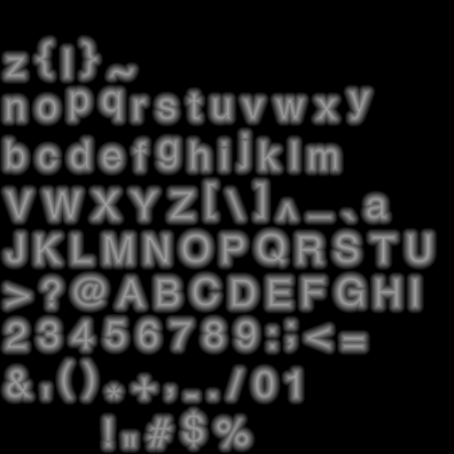
</a>
<a href="docs/readme/sd_font_dr.png">

</a>

And the following images are taken from same sample rendering using the shaders in the demo program.
The left image is from the original vicinity search and the right image is from the dead reckoning algorithm. Both are from the PNG files of 512x512 and spread of 0.2.

<a href="docs/readme/experiment_vicinitysearch.png">
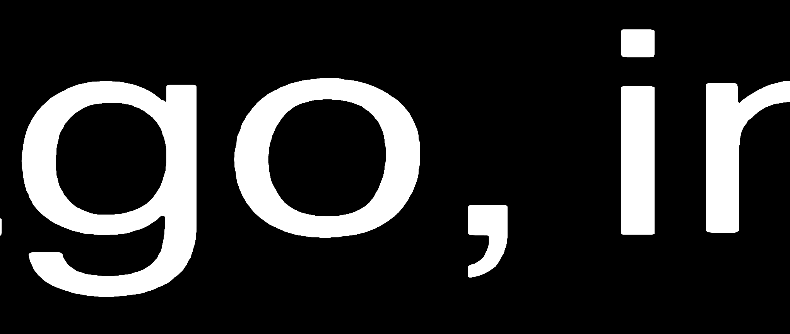
</a>
<a href="docs/readme/experiment_dead_reckoning.png">
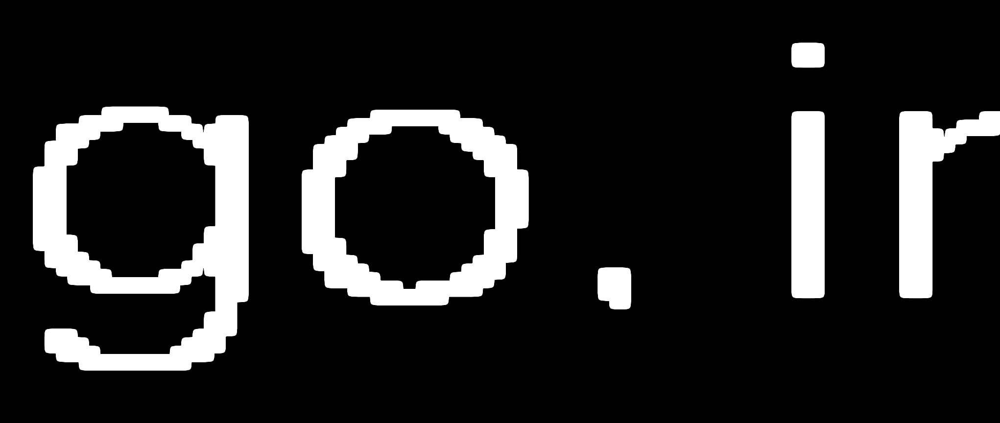
</a>

&nbsp;

As shown above, it seems in many cases the inaccuracy is not tolerable for the purpose of the signed-distance fonts.
In the signed-distance fonts, each value in the texture carries significant information to correctly to render the glyph at runtime. Hence, it is strongly desirable to calculate the signed distance values accurately with an exact algorithm as opposed to an approximation algorithms.

After some investigations, the inaccuracy observed in the dead-reckoning algorithm stems from the following.

1. The application of the *if* clauses in the forward and backward scan to locally update the signed distance values. This can be illustrated by the following example.

<a href="docs/readme/dead_reckoning_01.png">
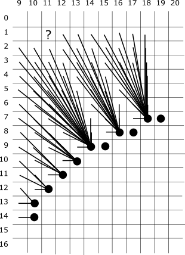
</a>

This is a snapshot of the backward scan phase in which the minimum distance for the point ( 11, 1 ) is about to be calculated from its 4 neighbors. The points with the black dots indicate the boundary points with the minimum distance 0. The part around the point (11, 1) is magnified below.

<a href="docs/readme/dead_reckoning_02.png">
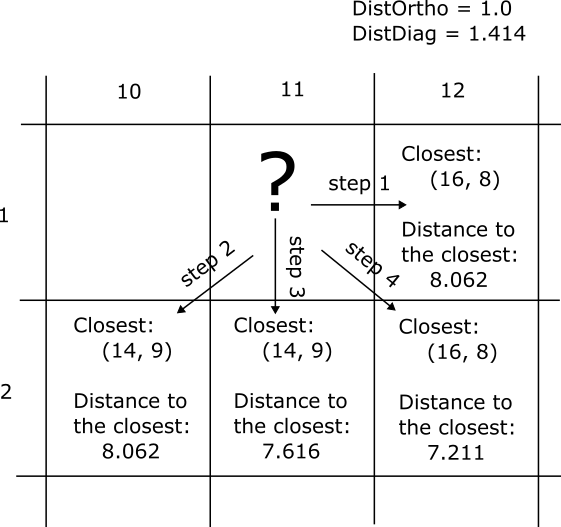
</a>

- At step 1, the minimum distance and its associated closest point at the point (12, 1)
are examined. Assume the current minimum distance at point (11, 1) is not found
 (infinity), then we tentatively set the associated closest point at (11, 1) to the one at (12, 1), which is (16, 8). Calculate the distance between (11, 1) and (16,8) to be 8.602.

- At step 2, the minimum distance and the closest point at (10, 2) are tried.
The distance from (10,2) to its associated closest point (14, 9) is 8.062.
The diagonal distance from (11, 1) to (10,2) is 1.414.
The current minimum distance at (11,1) is 8.602, which has been calculated at step 1.
Comparing 8.062 + 1.414 with 8.602, 8.602 is lower. Hence the minimum distance and
the associated closest point are not updated.

- At step 3, the info at (11,2) is examined. In the same way as in step 2, the sum of
the distance 7.616 + 1.0 is compared with 8.602, and no update is performed for (11,1).

- At step 4, the info at (12,2) is examined. The sum of the distance 7.211 + 1.414 is compared with 8.602, and no update is performed.

In the end, the minimum distance and its associated closest point for (11,1) are found as follows.

<a href="docs/readme/dead_reckoning_03.png">
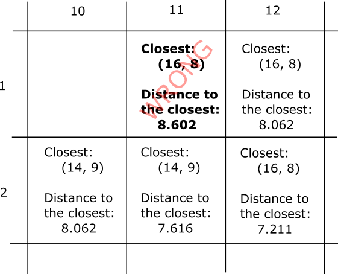
</a>

The actual minimum distance and its associated closest point are 8.544 and (14, 9) respectively. The error is gradually built up this way and propagated to the surrounding points.

2. The use of neighbors and local search (like the Dijkstra's algorithm) to update the signed distance values in the forward and backward scan. The assumption for Bell-man-equation like characteristics do not hold well. In my experiments, I have increased the number of scans (both forward and backward) with various paths, but non-negligible error was still observed.

3. Polarity-agnostic calculation of the distance. The original vicinity search algorithm finds a closest point of the opposite polarity for each point. In other words, if the current target point is in the glyph (black/inked), the closest point found is outside the glyph (white), and vice-versa. And the minimum signed distance is 1.0 (an orthogonally adjacent point). However, the polarity is ignored in the first few phases of the dead-reckoning algorithm. The closest point found will be in most cases of the same polarity, and the minimum signed distance is (incorrectly) 0. This may contribute to the inaccuracy significantly, especially if the beam width/sickness of the glyph is 4 to 6 pixels.

Increasing the kernel size from 3x3 to 5x5 or larger may incrase the accuracy, but I have not tried this idea yet. Any advice and suggestions to increase the accuracy with the dead-reckoning algorithm (or any other algorithms) would be appreciated.

Another idea is to perform the dead-reckoning for a bigger glyph bitmap and then down-sample the values, by taking the average of each regular rectangular region. It may work if the error accummulated in each rectangular region is statistically independent, which may not be likely, as the errors seem to be radially propagated outwards.


## Appendix B: Using Gaussian Blur for Font Rendering.
The blurred images have a superficial resemblence to the signed-distance fonts, when they are visualized as gray-scale images. On a side note, the following shows some results from the fun experiment of using Gaussian Blur as a signed-distance font.

The following PNG file is obtained by applying the Gaussia-blur effect with GIMP.
<a href="docs/readme/sd_font_gb2.png">
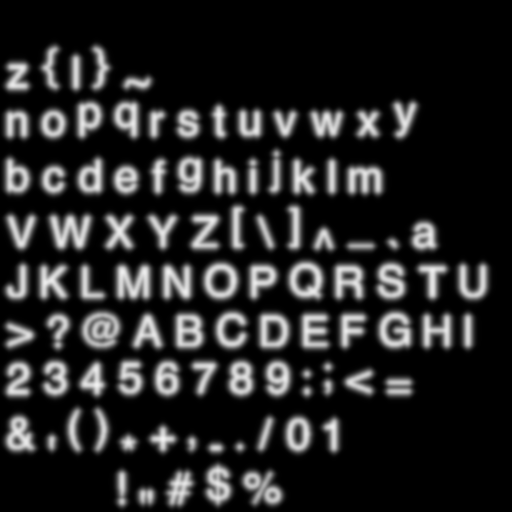
</a>

And the following is the result of the rendering.

<a href="docs/readme/experiment_gaussianblur.png">

</a>

As you can see, the details of the glyph shapes, especially the edges and corners are lost, but it could be used for some interesting visual effects.

